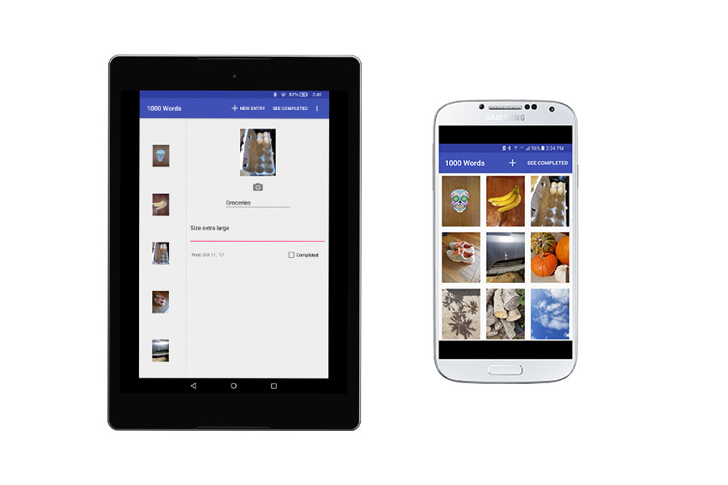

  
  
  
  

    

      <a class="project-links__link" target="_blank" href="https://github.com/rachelumunoz/aThousandWords"> 
         See the code 
         <i class="fa fa-code" aria-hidden="true"></i> 
      </a>
      <a class="project-links__link" target="_blank" href="https://play.google.com/apps/testing/com.moon_rocks_dev.aThousandWords">
         Beta Download
         <i class="fa fa-external-link" aria-hidden="true"></i> 
      </a>
    
  
    
 
      A picture's worth a thousand words, but sometimes all you need is a photograph!
       
      This Android App allows you to:
      <li>Take photos and use them as a way to set reminders</li>
      <li>Filter through your completed tasks</li>
      <li>Add notes to your image so you can remember more</li>
    

    

      <strong>Tools used:</strong>
       Android SDK, Java, RecyclerView, SQLite DB, Fragments, FileProvider, Glide, MVC
    

  

