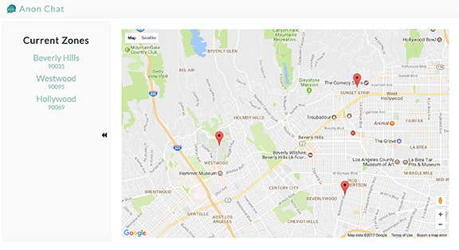

  
  
  
  

    

      <a class="project-links__link" target="_blank" href="https://github.com/rachelumunoz/anon-chat"> 
         See the code 
         <i class="fa fa-code" aria-hidden="true"></i> 
      </a>
      <a class="project-links__link" target="_blank" href="https://the-anon-chat.herokuapp.com/">
         View live 
         <i class="fa fa-external-link" aria-hidden="true"></i> 
      </a>
    
  
    
 This is a full stack application based off of the web app Yik Yak. The goal was to create a platform that users can post anonymous comments based off of a chosen location.
    

    

      <strong>Tools used:</strong>
      Node.js, Express, ES6, React, Redux, Thunk, MongoDB, React Transition Group, Google Maps API, SASS, mobile first design, Webpack
    

  

