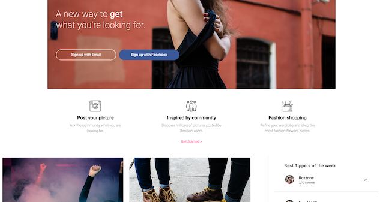

  
  
  
  

    

      <a class="project-links__link" target="_blank" href="https://github.com/rachelumunoz/dribbble-code-up-2"> 
         See the code 
         <i class="fa fa-code" aria-hidden="true"></i> 
      </a>
      <a class="project-links__link" target="_blank" href="https://rachelumunoz.github.io/dribbble-code-up-2/">
         View live 
         <i class="fa fa-external-link" aria-hidden="true"></i> 
      </a>
    
  
    
 This static site is built off of a mock up found on dribbble.com. Implementing a mobile first design, this site leverages Sass and BEM for modularity and organization of the CSS.
    

    

      <strong>Tools used:</strong>
       html5, sass, css3 transitions, flexbox, bem
    

  

