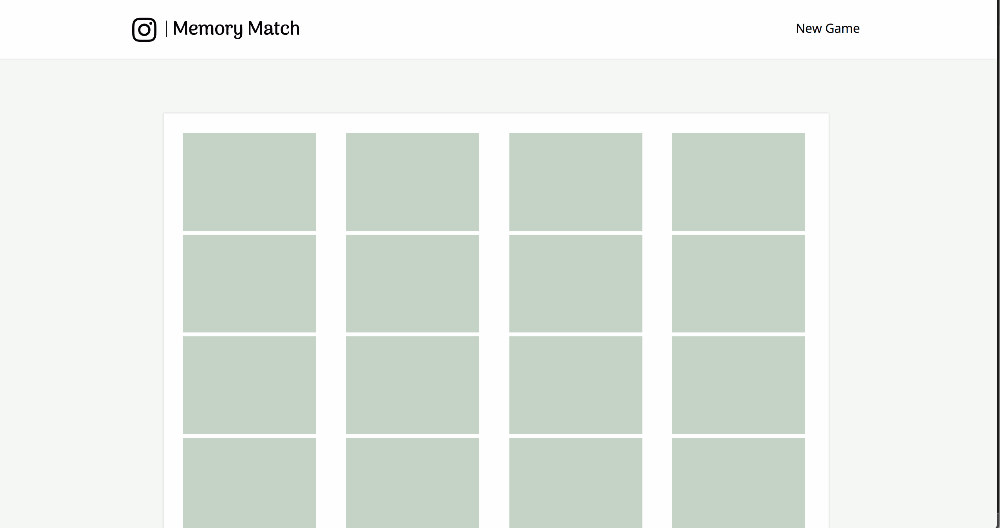

<figure style="width:50%;" class="floatLeft">
  
  <figcaption>image of memory match</figcaption>
</figure>

  Lorem ipsum dolor sit amet, consectetur adipisicing elit. Vero eum mollitia dolor, reprehenderit ut temporibus asperiores recusandae cupiditate fugiat, eius labore nemo, delectus nobis commodi soluta aperiam maiores sapiente. Eveniet?

  <a href="#">Code</a>
  <a href="#">Live</a>

  