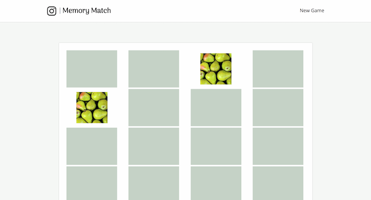

  
  
  
  

    

      <a class="project-links__link" target="_blank" href="https://github.com/rachelumunoz/memory-match"> 
         See the code 
         <i class="fa fa-code" aria-hidden="true"></i> 
      </a>
      <a class="project-links__link" target="_blank" href="http://memory-match.herokuapp.com/">
         View live 
         <i class="fa fa-external-link" aria-hidden="true"></i> 
      </a>
    
  
    
 Play a game of memory with your Instagram images. This app allows a user to grant access to their images so they can play a game with snapshots of their memories.
    

    

      <strong>Tools used:</strong>
      Node.js, Express, vanilla JavaScript, jQuery, Gulp, Nunjucks
    

    

      
To play with an example account, sign in with these credentials: 

      <strong> username </strong>: memory_match_user
      
 <strong> password: </strong> memory

    

  

