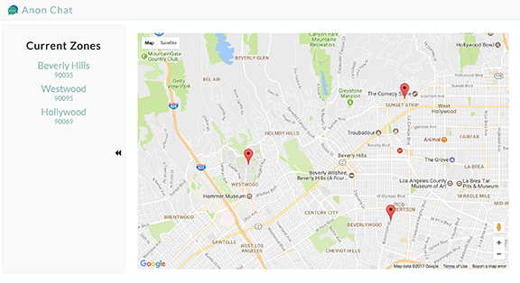

<figure style="width:50%;" class="floatLeft">
  
  <figcaption>image of anon chat</figcaption>
</figure>

  This is a full stack application based off of the web app Yik Yak. The goal was to create a platform that users can post anonymous comments based off of a chosen location.

  Node.js, Express
  React, Redux 
  MongoDB
  Animations
  Google Maps API
  SASS
  mobile first design

  <a target="_blank" href="https://github.com/rachelumunoz/anon-chat">Code</a>
  <a target="_blank" href="https://the-anon-chat.herokuapp.com/">Live</a>

  